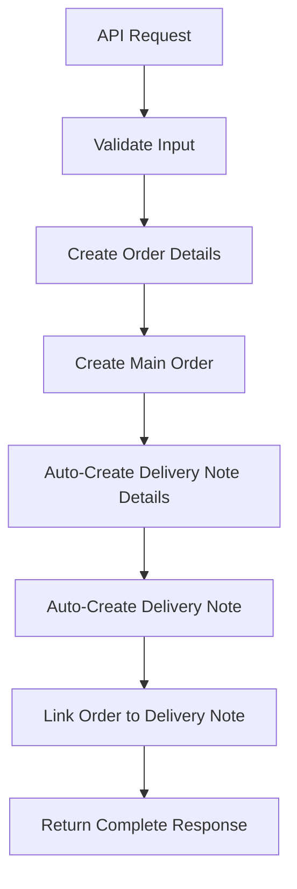

# Create Order API Documentation

## Overview

The Create Order API allows you to create customer orders with automatic delivery note generation. This API has been refactored to use ID-based relationships instead of names, includes unit conversion tracking, and automatically creates linked delivery notes for complete order fulfillment workflow.

## Key Features

- ✅ **ID-Based Relationships**: Uses customer_id and product_id instead of names for data integrity
- ✅ **Unit Conversion Support**: Includes unit_conversions_id for proper inventory tracking
- ✅ **Automatic Delivery Note**: Creates delivery note automatically after order creation
- ✅ **Complete Workflow**: Single API call handles entire order fulfillment process
- ✅ **Linked Records**: Order and delivery note are properly linked via order_id
- ✅ **Real-time Calculations**: Automatic total calculations with VAT

## API Endpoint

### Create Order with Automatic Delivery Note

**Endpoint:** `POST /orders/create-order`

**Description:** Create a customer order with automatic delivery note creation. Uses ID-based relationships for data integrity and includes unit conversion tracking for accurate inventory management.

#### Headers
```
Authorization: Bearer <access_token>
Content-Type: application/json
Accept: application/json
```

#### Request Schema

```json
{
  "customer_id": "string",
  "order_details": [
    {
      "product_id": "string",
      "unit_conversions_id": "string",
      "unit_price": "number",
      "quantity": "number",
      "vat": "number"
    }
  ],
  "delivery_type": "string (default: 'Xuất bán')"
}
```

#### Field Descriptions

| Field | Type | Required | Description |
|-------|------|----------|-------------|
| `customer_id` | string | Yes | ID of the customer from customer table |
| `order_details` | array | Yes | Array of order detail items |
| `order_details[].product_id` | string | Yes | ID of the product from product table |
| `order_details[].unit_conversions_id` | string | Yes | ID of unit conversion for proper tracking |
| `order_details[].unit_price` | number | Yes | Unit price for this item |
| `order_details[].quantity` | number | Yes | Quantity ordered |
| `order_details[].vat` | number | Yes | VAT rate for this item |
| `delivery_type` | string | No | Type of delivery (default: "Xuất bán") |

#### Example Request

```json
{
  "customer_id": "recCustomer001",
  "order_details": [
    {
      "product_id": "recProduct001",
      "unit_conversions_id": "recUnitConv001",
      "unit_price": 15000,
      "quantity": 50,
      "vat": 10
    },
    {
      "product_id": "recProduct002",
      "unit_conversions_id": "recUnitConv005",
      "unit_price": 350000,
      "quantity": 10,
      "vat": 8
    }
  ],
  "delivery_type": "Xuất bán"
}
```

#### Response Schema

```json
{
  "status": "string",
  "detail": "string",
  "order_id": "string",
  "order_code": "string",
  "delivery_note_id": "string",
  "delivery_note_code": "string",
  "customer_id": "string",
  "total_items": "number",
  "total_temp": "number",
  "total_vat": "number",
  "total_after_vat": "number"
}
```

#### Example Response

```json
{
  "status": "success",
  "detail": "Đơn hàng và phiếu xuất đã được tạo thành công",
  "order_id": "recOrder001",
  "order_code": "DH-02012025-001",
  "delivery_note_id": "recDeliveryNote001",
  "delivery_note_code": "PX-02012025-001",
  "customer_id": "recCustomer001",
  "total_items": 2,
  "total_temp": 4250000,
  "total_vat": 408000,
  "total_after_vat": 4658000
}
```

## Workflow Process

### 1. Order Creation Flow



### 2. Data Relationships

```
Order Table:
├── customer_id → Customer Table
└── order_details → Order Details Table
    ├── product_id → Product Table
    └── unit_conversions_id → Unit Conversions Table

Delivery Note Table:
├── order_id → Order Table (AUTO-LINKED)
├── customer_id → Customer Table
└── delivery_note_details → Delivery Note Details Table
    ├── product_id → Product Table
    └── unit_conversions_id → Unit Conversions Table
```

## Business Use Cases

### Complete Order Fulfillment

Single API call creates:
1. **Order Record** with customer and product links
2. **Order Details** with unit conversion tracking
3. **Delivery Note** linked to the order
4. **Delivery Note Details** with same products/quantities
5. **Automatic Calculations** for all totals

### Multi-Unit Order Example

```json
{
  "customer_id": "recCustomer001",
  "order_details": [
    {
      "product_id": "recCocaCola330ml",
      "unit_conversions_id": "recUnitThung",
      "unit_price": 4200000,
      "quantity": 5,
      "vat": 5
    },
    {
      "product_id": "recCocaCola330ml", 
      "unit_conversions_id": "recUnitLoc",
      "unit_price": 350000,
      "quantity": 20,
      "vat": 8
    }
  ]
}
```

**Result:**
- 5 Thùng (5 × 288 = 1,440 Chai equivalent)
- 20 Lốc (20 × 24 = 480 Chai equivalent)
- **Total:** 1,920 Chai in standardized units

### Inventory Impact

The order automatically updates inventory through:
1. **Unit Conversion Tracking** - Proper unit standardization
2. **Delivery Note Creation** - Inventory reduction records
3. **Linked Records** - Complete audit trail

## Error Handling

### Common Error Responses

#### 400 Bad Request - Invalid Customer ID
```json
{
  "detail": "Customer ID 'recCustomer999' không tồn tại"
}
```

#### 400 Bad Request - Invalid Product ID
```json
{
  "detail": "Product ID 'recProduct999' không tồn tại"
}
```

#### 400 Bad Request - Invalid Unit Conversion
```json
{
  "detail": "Unit conversion ID 'recUnit999' không hợp lệ cho sản phẩm này"
}
```

#### 401 Unauthorized
```json
{
  "detail": "Token không hợp lệ hoặc đã hết hạn"
}
```

#### 500 Internal Server Error
```json
{
  "detail": "Lỗi không mong muốn khi tạo đơn hàng"
}
```

## Integration Examples

### JavaScript/Node.js

```javascript
const createOrder = async (orderData) => {
  try {
    const response = await fetch('/orders/create-order', {
      method: 'POST',
      headers: {
        'Authorization': `Bearer ${accessToken}`,
        'Content-Type': 'application/json'
      },
      body: JSON.stringify(orderData)
    });
    
    const result = await response.json();
    
    if (response.ok) {
      console.log('Order created:', result.order_id);
      console.log('Delivery note created:', result.delivery_note_id);
      console.log('Total amount:', result.total_after_vat);
    } else {
      console.error('Error:', result.detail);
    }
  } catch (error) {
    console.error('Network error:', error);
  }
};

// Usage example
const orderData = {
  customer_id: "recCustomer001",
  order_details: [
    {
      product_id: "recProduct001",
      unit_conversions_id: "recUnitConv001",
      unit_price: 15000,
      quantity: 100,
      vat: 10
    }
  ],
  delivery_type: "Xuất bán"
};

createOrder(orderData);
```

### Python

```python
import requests

def create_order(order_data, access_token):
    headers = {
        'Authorization': f'Bearer {access_token}',
        'Content-Type': 'application/json'
    }
    
    response = requests.post(
        '/orders/create-order',
        json=order_data,
        headers=headers
    )
    
    if response.status_code == 200:
        result = response.json()
        print(f"Order created: {result['order_id']}")
        print(f"Delivery note: {result['delivery_note_id']}")
        print(f"Total: {result['total_after_vat']:,} VND")
        return result
    else:
        print(f"Error: {response.json()['detail']}")
        return None

# Usage example
order_data = {
    "customer_id": "recCustomer001",
    "order_details": [
        {
            "product_id": "recProduct001",
            "unit_conversions_id": "recUnitConv001", 
            "unit_price": 15000,
            "quantity": 100,
            "vat": 10
        }
    ],
    "delivery_type": "Xuất bán"
}

create_order(order_data, access_token)
```

## Best Practices

### 1. Data Validation
- Always validate customer_id exists before creating order
- Verify product_id and unit_conversions_id compatibility
- Check inventory availability before order creation

### 2. Unit Conversion Selection
- Use appropriate unit conversions for customer type
- Consider bulk discounts for larger units
- Ensure unit conversion matches customer expectations

### 3. Error Handling
- Implement retry logic for network failures
- Provide clear error messages to users
- Log errors for debugging and monitoring

### 4. Performance Optimization
- Cache frequently used customer and product data
- Batch multiple orders when possible
- Monitor API response times

### 5. Business Logic
- Validate minimum order quantities
- Apply business rules for pricing
- Consider customer credit limits

## Migration Notes

### From Previous Version

**Old Structure (Name-Based):**
```json
{
  "customer_name": "Nguyễn Văn An",
  "order_details": [
    {
      "product_name": "Coca Cola 330ml",
      "unit_price": 15000,
      "quantity": 100,
      "vat": 10
    }
  ]
}
```

**New Structure (ID-Based):**
```json
{
  "customer_id": "recCustomer001",
  "order_details": [
    {
      "product_id": "recProduct001",
      "unit_conversions_id": "recUnitConv001",
      "unit_price": 15000,
      "quantity": 100,
      "vat": 10
    }
  ]
}
```

### Key Changes

- ❌ Removed `customer_name` → ✅ Added `customer_id`
- ❌ Removed `product_name` → ✅ Added `product_id`
- ✅ Added `unit_conversions_id` for proper unit tracking
- ✅ Added automatic delivery note creation
- ✅ Added `delivery_type` field
- ✅ Enhanced response with both order and delivery note info

### Benefits of Migration

1. **Data Integrity** - Foreign key relationships prevent invalid references
2. **Performance** - ID-based lookups are faster than name searches
3. **Consistency** - Eliminates name variation issues
4. **Automation** - Complete order fulfillment in single API call
5. **Tracking** - Better inventory management with unit conversions
